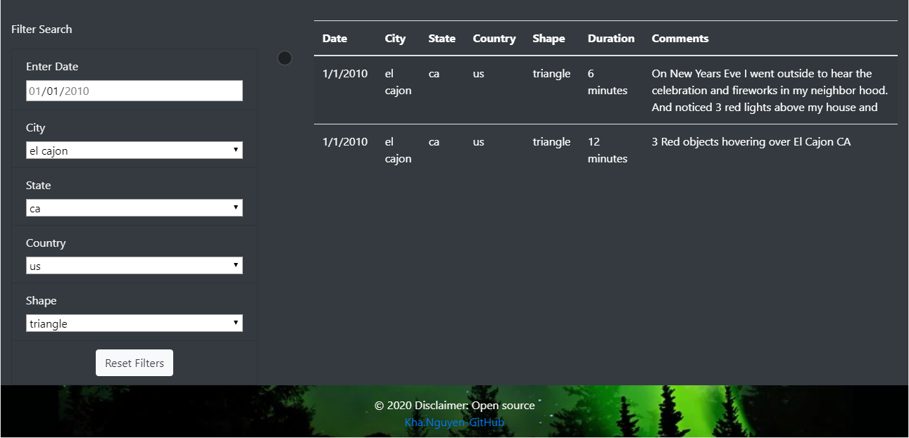

# UFOs (The Truth is out there)
---

**Summary**
---

The website has been finished, and the article is ready to go, but it need to improved even more. Instead of filtering by a single datetime filter, let expand ability to search a city or country or even combine a date with a location. A Robust search ability will help users easily to navigate the website application.

**Goals**
---

1. Create, update, and deploy JavaScript functions to provide additional table filters.
2. Update and deploy forEach (for loop) to loop through the filters and update them with user input.
3. Update and populate the dynamic filters and table using JavaScript and HTML.

**Enhancements**

1. Take advatages of HTML 5 input (datetime, number, or dropdown)
2. Add the embebed video (YouTube, Hulu, or Vudu) about UFO news
3. Make table data to be responsive
4. Enhance filters display looks right in all screen sizes

**Recommendation**

1. Let find UFOs API to do dynamic search instead of the static JSON data file
2. Let scrape some UFOs news from websites and update the home page instead of static text news
3. Table data display needs to be modified so it can look great in small mobile phone.

**Languages**
---

1. Javascript ES6 standard
2. D3.js
3. Boostrap 4 (Mobile first) instead of Boostrap 3 (Desktop first)
4. CSS3 
5. HTML5

**Software**
---

1. Visual Studion Code
2. Node.js (run local web application)

**Resources**
--
1. [app.js](static/js/app.js) <-- the javascript (Controller)
2. [index.html](index.html) <-- the html (Viewer)
3. [data.js](static/js/data.js) <-- the data (Model)
4. [style.css](static/css/style.css) <-- the UI styles

**Screenshots**
---

**Search Criteria (Filters)**

**Desktop**

**Ipad or Surface**

**Iphone or Note10**

